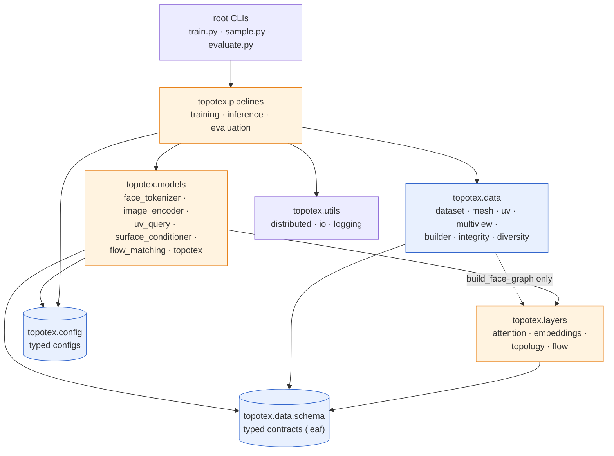
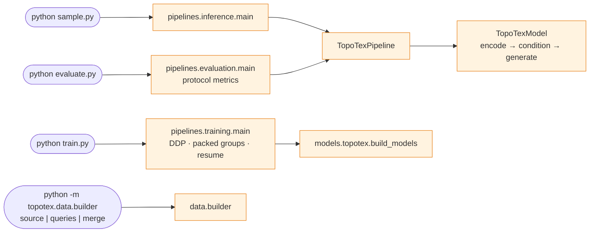

# TOPOTEX Architecture

One frozen pipeline (36.9M parameters):

```
Reference Image + Mesh
    → six generated canonical views          (offline, frozen UniTEX stage-1)
    → Surface Conditioner                    (models/surface_conditioner/)
        FaceTokenizer  →  Face-View Cross Attention  →  Topology Transformer
    → Face Set Latent  Z_F  [F, 256]
    → Global UV Query Attention              (any UV layout as query)
    → UV condition [64, 256, 256]
    → Texture Generator                      (models/texture_generator/)
        MiniDiT under masked cosine diffusion, DDIM-50
    → UV texture [3, 256, 256]
```

## Design principle

The mesh essence is the **Face Set**. XYZ is a geometric observation
(changed by rigid transforms); a UV atlas is one replaceable 2D addressing
scheme. `(face_id, barycentric)` is the stable identity of a surface point,
so the latent is indexed by faces and every consumer addresses it through
face/bary queries.

## Surface Conditioner

### FaceTokenizer (`face_tokenizer.py`)
Per-face **intrinsic** features only — no world coordinates, no UV, no face
index:
- 3 edge lengths / mesh scale (`sqrt(total area)`)
- 3 edge lengths / perimeter
- 3 corner angles / π (sorted within face → corner-order invariant)
- log-normalized face area, boundary-edge fraction

Concatenated with a random-walk topology PE (k=16, pure graph structure)
and passed through an MLP → face tokens `[F, 256]`. Ratio-based features
make the tokens exactly invariant to rotation, translation, and uniform
scale, and winding-agnostic.

The face graph (shared-edge adjacency, relation features = edge length /
unoriented dihedral / boundary flag) is built by `build_face_graph`. A
cached graph is only valid for the vertices it was built from;
`SurfaceConditioner.encode_faces` validates the cached graph's global scale
against the current vertices and rebuilds on mismatch.

### Multi-view Image Encoder (`image_encoder.py`)
From scratch (no pretrained backbone): conv patch embedding (patch 16) +
2D position embedding + learnable per-view embedding, joint self-attention
over all view tokens → image tokens `[6·256, 256]`.

### Face–View Cross Attention (`face_image_attention.py`)
Q = face tokens, K/V = image tokens: appearance injection into the face
set.

### Topology Transformer (`topology_transformer.py`)
Sparse graph attention along the shared-edge face adjacency only (no
euclidean KNN), with a learned relation bias from (shared edge length,
dihedral, boundary). Output = the canonical Face Set latent `Z_F [F, 256]`.

### Global UV Query Attention (`uv_query_attention.py`)
```
per-texel:  [ face_token(face_id) ‖ bary_encoding(barycentric) ] → texel feature (32)
patchify:   256×256, patch 8 → 32×32 = 1024 query tokens (+ learned atlas pos emb)
4 × CrossBlock:  Q = UV query tokens,  K,V = Z_F   (global, no routing, no masks)
unpatchify: uv_condition [64, 256, 256]  (background zeroed)  + optional RGB head
```
The UV layout enters only through which faces each patch references;
surface content flows exclusively through attention over `Z_F`. This is
what makes the parameterization swappable at inference time — including
partial (face-subset) queries.

## Texture Generator

`MiniDiT` (`topotex/models/flow_matching.py`): pixel-space transformer at 256², patch 8,
AdaLN-Zero, serving as the velocity network; conv embeddings for noisy
image / condition / valid mask, sin-cos 2D positions. `MaskedFlowMatching`
(`topotex/layers/flow.py`): rectified flow — linear interpolation path
`x_tau = (1-tau)·x0 + tau·eps`, velocity-MSE loss restricted to the valid
mask (invalid region fixed at 0 through the whole trajectory), 50-step
Euler ODE sampling.

## Training recipe (frozen, `configs/topotex_fm_baseline.yaml`)

One mesh per step; one stored query per step drawn with
`query_probs = [0.5, 0.3, 0.2]` (canonical / alternative / partial);
noise batch 4 with high-t emphasis (half the batch from t ∈ [700, 1000]);
auxiliary RGB L1 (0.1); AdamW lr 3e-4, warmup 100, cosine to 10%;
2000 exposures per mesh. Checkpoints carry model/optimizer/RNG state and
resume exactly.
# TOPOTEX Code Architecture

One installable package (`topotex/`), thin root CLIs, strict layer
boundaries. Produced by the behavior-preserving architecture refactor —
model mathematics, tensor shapes, the dataset schema, checkpoint
state-dict keys, the query sampling recipe, the flow-matching schedule and
the evaluation protocol are all unchanged (verified against a frozen
golden baseline, see `tests/test_golden_equivalence.py`).

## Package dependency diagram



Enforced boundaries:

- `data` never imports `models` (face-graph building lives in
  `layers.topology`, a pure tensor function).
- `layers` performs no file IO; modules are torch + `schema` only.
- `models` consume/produce tensors and typed contracts; they never read
  environment variables or change the working directory.
- `pipelines` orchestrate data + models + checkpoints + sampling.
- Root CLI files only parse arguments and call pipelines.
- The UniTEX adapter (`topotex.data.multiview`) is used exclusively by the
  offline builder — never at inference.

## Public API (`import topotex`)

| symbol | role |
|---|---|
| `TopoTexPipeline` | `from_checkpoint(path)` → `pipeline(mesh=…, uv_query=…, images=…, num_steps=50, seed=…)` → `TopoTexOutput` |
| `TopoTexModel` | composed module (`conditioner` + `dit` + `schedule`); `from_checkpoint` / `from_config`; staged `encode` / `condition` / `generate` |
| `TopoTexConfig` | typed aggregate of `DataConfig` / `SurfaceConditionerConfig` / `FlowMatchingConfig` / `TrainingConfig`; `from_yaml` validates, `to_dict` round-trips the frozen flat checkpoint layout |
| `TopoTexDataset` | loader returning `TopoTexBatch` items |
| `TopoTexBatch` `MeshBatch` `UVQueryBatch` `FaceGraph` `ConditionerOutput` `TopoTexOutput` | typed tensor contracts (dict-compatible: `obj["key"]` and `obj.get` still work) |
| `build_models` | frozen factory: flat config dict → `(conditioner, dit)` (seeds torch first) |

```python
from topotex import TopoTexDataset, TopoTexPipeline

pipe = TopoTexPipeline.from_checkpoint("checkpoints/baseline")
item = TopoTexDataset(root, [sid], device="cuda:0").items[0]
z = pipe.encode(item.mesh, item.mv_images, item.graph)   # Z_F, reusable
out = pipe(mesh=item.mesh, uv_query=item.uv_queries[0], face_tokens=z)
out.texture   # uint8 [256, 256, 3]
```

`reference_image` alone is not consumable at inference: the model is
conditioned on six canonical views; generating views from one reference is
the offline UniTEX stage (`topotex.data.multiview`).

## Module responsibilities

| module | responsibility | was |
|---|---|---|
| `topotex/config.py` | typed configs; YAML → dataclasses; frozen flat round-trip | inline `yaml.safe_load` in train.py |
| `topotex/data/schema.py` | schema constants + all typed contracts | scattered dicts |
| `topotex/data/dataset.py` | `TopoTexDataset` loader | `datasets/dataset.py` |
| `topotex/data/mesh.py` | cameras, rasterized views, rebake render, seam metric | `datasets/mesh_utils.py` |
| `topotex/data/uv.py` | deterministic UV address rasterizer + connected face subsets | `datasets/rasterizer.py` + `datasets/uv_query.py` |
| `topotex/data/multiview.py` | frozen UniTEX stage-1 adapter (offline only) | `datasets/mv_generator.py` |
| `topotex/data/builder.py` | offline construction CLI: `source` / `queries` / `merge` subcommands | `datasets/build_dataset.py` + `build_uv_queries.py` + `merge_manifest.py` |
| `topotex/data/integrity.py` | recursive post-finalize integrity gate | `datasets/verify_integrity.py` |
| `topotex/data/diversity.py` `statistics.py` | dataset monitors | `datasets/dataset_diversity.py` / `dataset_statistics.py` |
| `topotex/layers/attention.py` | face–image cross attention | `face_image_attention.py` |
| `topotex/layers/topology.py` | `build_face_graph` + random-walk PE + sparse topology transformer | `face_tokenizer.py`(part) + `topology_pe.py` + `topology_transformer.py` |
| `topotex/layers/embeddings.py` | sincos pos embed, patchify/unpatchify, timestep embed, bary encoding | parts of `dit.py` / `uv_query_attention.py` |
| `topotex/layers/flow.py` | rectified-flow schedule (`MaskedFlowMatching`) | `texture_generator/flow_matching.py` |
| `topotex/models/face_tokenizer.py` | intrinsic features → face tokens | `face_tokenizer.py` |
| `topotex/models/image_encoder.py` | multi-view ViT encoder | `image_encoder.py` |
| `topotex/models/uv_query.py` | Global UV Query Attention decoder | `uv_query_attention.py` |
| `topotex/models/surface_conditioner.py` | Z_F encoder + decoder composition | `conditioner.py` |
| `topotex/models/flow_matching.py` | MiniDiT velocity network | `texture_generator/dit.py` |
| `topotex/models/topotex.py` | `TopoTexModel` + `build_models` factory | `train.py::build_models` |
| `topotex/pipelines/training.py` | frozen DDP training recipe (packed groups, bucket sampler, resume) | `train.py` body |
| `topotex/pipelines/inference.py` | `TopoTexPipeline` + sampling CLI | `sample.py` body |
| `topotex/pipelines/evaluation.py` | closed-loop evaluation protocol | `evaluate.py` body |
| `topotex/utils/*` | `ddp_env`, sha/json IO, structured logging | inline helpers |

## Tensor contracts

Documented on each dataclass in `topotex/data/schema.py` (F faces,
V vertices, E adjacency edges, H = W = 256, Nv = 6 views):

- `MeshBatch`: `vertices f32 [V,3]`, `faces i64 [F,3]`
- `FaceGraph`: `edges i64 [E,2]`, `rel f32 [E,3]`, `boundary f32 [F]`,
  `global_scale f32` (valid only for the vertices it was built from)
- `UVQueryBatch`: `face_id i64 [H,W]` (−1 = background), `barycentric
  f32 [3,H,W]`, `valid_mask bool [H,W]`, `gt_texture f32 [3,H,W]`,
  full-layout `uv_vertices/uv_faces` (numpy, rebake-safe)
- `ConditionerOutput`: `face_tokens f32 [F,D]` (Z_F), `uv_condition
  f32 [1,C,H,W]`, optional `uv_rgb f32 [1,3,H,W]`
- `TopoTexOutput`: `texture u8 [H,W,3]`, `uv_condition`, `face_tokens`

All contracts remain dict-compatible (`__getitem__` / `__setitem__` /
`get`), so the frozen training internals read identically.

## CLI → pipeline call graph



`scripts/*.sh` wrap the same entry points (torchrun for
`train_8gpu.sh`, rank-sharded `evaluate_8gpu.sh`, two-stage
`build_dataset_8gpu.sh` → `topotex.data.builder`).

## Numerical-equivalence policy

`checkpoints/golden/` holds pre-refactor captures (face features, Z_F,
query tokens, dense uv_condition, FM loss at fixed t, Euler-50 texture,
1-mesh evaluation metrics) for the frozen baseline checkpoint and a fixed
sample/seed. `tests/test_golden_equivalence.py` re-runs them through the
public API: bitwise for the tokenizer; 10× the measured same-code
run-to-run CUDA-nondeterminism envelope elsewhere (the topology
transformer's scatter kernels are nondeterministic — measured deltas:
Z_F ≤ 2.4e-5, uv_condition ≤ 3.1e-6, texture ≥ 118 dB run-to-run).
